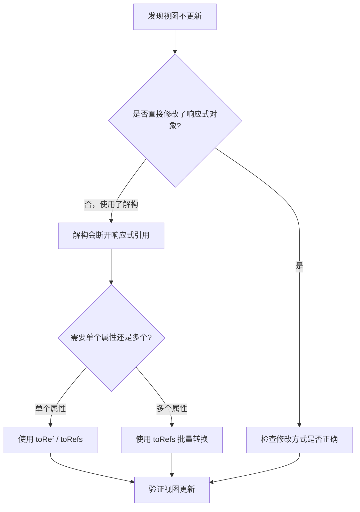

## 问题描述

在 Vue3 项目中，使用 `reactive` 定义的对象，经过解构赋值后，获取到的值不再具有响应式，修改解构后的变量不会触发视图更新。

## 报错信息

无显式报错，但视图不更新。例如：

```ts
import { reactive } from 'vue'

const state = reactive({ count: 0, name: 'test' })

// 解构后丢失响应式
const { count, name } = state

// 修改 count 不会触发视图更新
count++
```

## 排查过程



## 原因分析

`reactive` 返回的是一个 Proxy 代理对象。当对其进行解构时，获取的是原始值的拷贝，而非 Proxy 的引用，因此失去了响应式能力。

## 解决方案

### 方案一：使用 `toRefs`（推荐）

```ts
import { reactive, toRefs } from 'vue'

const state = reactive({ count: 0, name: 'test' })

// toRefs 将每个属性转为 ref，保持响应式
const { count, name } = toRefs(state)

// 通过 .value 修改
count.value++
```

### 方案二：使用 `toRef` 针对单个属性

```ts
import { reactive, toRef } from 'vue'

const state = reactive({ count: 0 })
const count = toRef(state, 'count')
count.value++
```

### 方案三：直接使用 `ref` 定义独立变量

```ts
import { ref } from 'vue'

const count = ref(0)
count.value++
```

## 经验总结

- `reactive` 对象解构会丢失响应式，必须通过 `toRefs` 转换
- `ref` 适合基本类型，`reactive` 适合对象，但要注意解构问题
- 模板中使用 `ref` 无需 `.value`，脚本中必须加 `.value`
