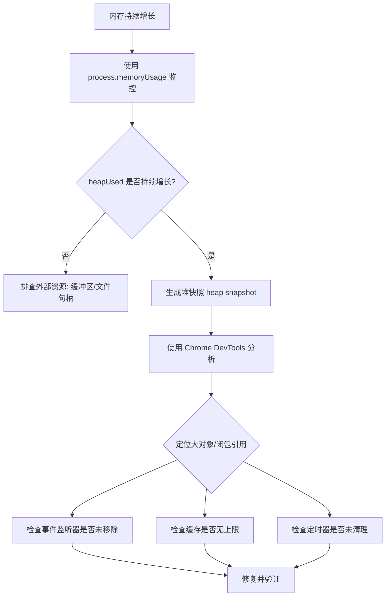

## 问题描述

线上 Node.js 服务运行一段时间后，内存占用持续增长，最终触发 OOM（Out of Memory）导致进程崩溃。

## 报错信息

```
FATAL ERROR: Reached heap limit Allocation failed - JavaScript heap out of memory
```

## 排查过程



## 常见原因

### 1. 全局缓存无上限

```ts
// 错误示例：缓存无限增长
const cache = new Map()

function getData(key) {
  if (!cache.has(key)) {
    cache.set(key, fetchFromDB(key))
  }
  return cache.get(key)
}
```

**修复**：使用 LRU 缓存限制大小。

```ts
import { LRUCache } from 'lru-cache'

const cache = new LRUCache({ max: 1000, ttl: 1000 * 60 * 5 })
```

### 2. 事件监听器未移除

```ts
// 错误示例：每次请求都添加监听器
app.use((req, res) => {
  emitter.on('data', handleData)
})
```

**修复**：请求结束时移除监听器，或使用 `once`。

### 3. 闭包持有大对象

```ts
// 错误示例：闭包持有大数组
function createHandler() {
  const largeData = new Array(1000000).fill(0)
  return () => {
    // 即使不使用 largeData，闭包仍持有引用
    console.log('handler called')
  }
}
```

## 定位工具

- `process.memoryUsage()`：实时监控内存
- `--inspect` + Chrome DevTools：抓取并分析堆快照
- `clinic.js`：Node.js 性能诊断工具
- `heapdump`：手动生成堆快照

## 经验总结

- 缓存必须设置上限，优先使用 LRU 策略
- 事件监听器遵循"谁添加谁移除"原则
- 定时器（setInterval）必须在不需要时 clear
- 定期抓取堆快照对比，定位增长对象
