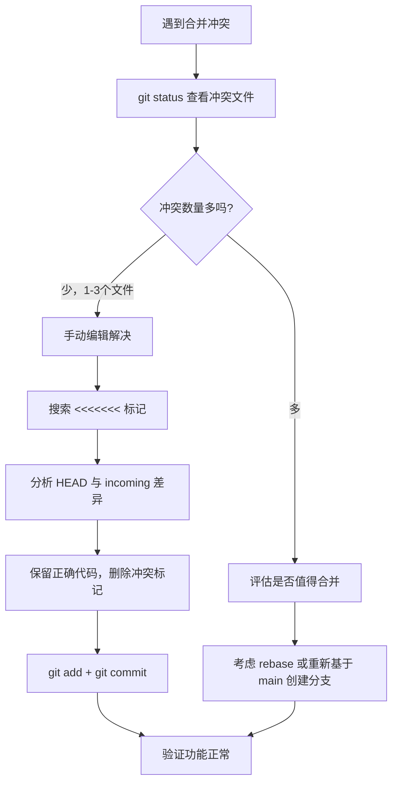

## 问题描述

在多人协作开发时，从 `main` 分支合并到功能分支，或提交 PR 时，经常遇到合并冲突（Merge Conflict）。

## 报错信息

```bash
$ git merge main
Auto-merging src/utils/request.ts
CONFLICT (content): Merge conflict in src/utils/request.ts
Automatic merge failed; fix conflicts and then commit the result.
```

## 排查过程



## 冲突标记说明

```ts
<<<<<<< HEAD
// 当前分支的代码
const timeout = 5000
=======
// 合并进来的代码
const timeout = 10000
>>>>>>> main
```

- `<<<<<<< HEAD` 到 `=======`：当前分支的内容
- `=======` 到 `>>>>>>> main`：要合并分支的内容

## 解决方案

### 方案一：手动编辑（适合少量冲突）

1. 打开冲突文件，找到 `<<<<<<<` 标记
2. 决定保留哪部分代码，或合并两者
3. 删除所有冲突标记（`<<<<<<<`、`=======`、`>>>>>>>`）
4. 执行 `git add <file>` 和 `git commit`

### 方案二：使用 mergetool（适合复杂冲突）

```bash
# 配置默认合并工具（如 VSCode）
git config --global merge.tool vscode

# 启动合并工具
git mergetool
```

### 方案三：使用 ours / theirs 策略

```bash
# 保留当前分支的版本
git checkout --ours src/utils/request.ts

# 保留合并分支的版本
git checkout --theirs src/utils/request.ts

git add src/utils/request.ts
```

## 预防策略

1. **频繁同步**：每天从 `main` 拉取最新代码，减少冲突积累
2. **小步提交**：避免一次性修改过多文件
3. **沟通协作**：修改公共文件前与团队成员沟通
4. **使用 rebase**：`git pull --rebase` 保持提交历史线性

## 经验总结

- 解决冲突前先理解双方代码意图，不要盲目选择
- 解决后务必运行测试，确认功能正常
- 冲突标记必须全部删除，否则会导致语法错误
- 复杂冲突建议使用可视化工具（VSCode、Beyond Compare）
